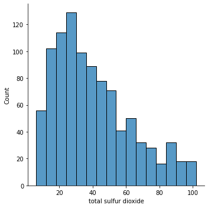
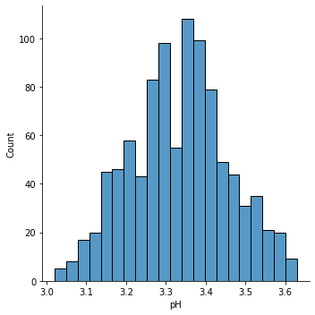
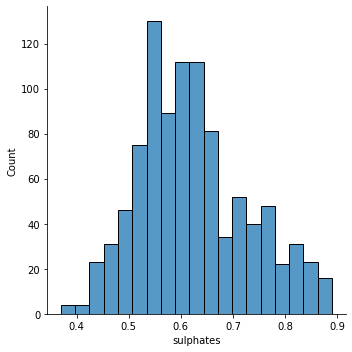
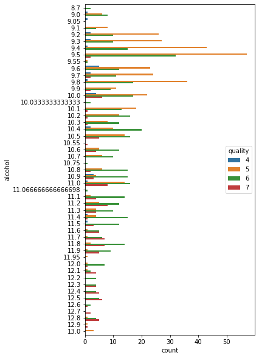

# Performing-EDA-with-given-Dataset
```
Assignment for: Subject Code: 19AI403
                Subject Name: Introduction to Data Science
                SA Number: A04

Written By: Name: Kaushika.A
            Roll Number:212221230048
            Year: I
            Semester: II

```
# Exploratory Data Analysis (EDA)
*In statistics,*
>Exploratory data analysis is an approach of analyzing data sets to summarize their main characteristics, often using statistical graphics and other data visualization methods. 


Primarily EDA is for seeing what the data can tell us beyond the formal modeling and thereby contrasts traditional hypothesis testing. 

EDA build a robust understanding of the data, issues associated with either the info or process. it’s a scientific approach to get the story of the data.

# TYPES OF EXPLORATORY DATA ANALYSIS:

- **Univariate Non-graphical**
- **Multivariate Non-graphical**
- **Univariate graphical**
- **Multivariate graphical**

# Performing EDA on given Dataset
```
Dataset name: winequality-red
Filetype: .csv
```
# Program(With Output)
```python
#importing libraries
import pandas as pd
import numpy as np
import seaborn as sns
import matplotlib.pyplot as plt

#loading and displaying dataset
df=pd.read_csv("winequality-red.csv")
df
```

```python
#data cleaning
#checking for null in data
df.isnull().sum()
```

```python
#Data is clean
#Detecting and removing outliers
plt.figure(figsize=(7,10))
df.boxplot()
plt.xticks(rotation = 45)
plt.show()
```

```python
#removing outliers
cols = ['fixed acidity','volatile acidity','citric acid','residual sugar','chlorides','free sulfur dioxide',
        'total sulfur dioxide','density','pH','sulphates','alcohol','quality']
Q1 = df[cols].quantile(0.25)
Q3 = df[cols].quantile(0.75)
IQR = Q3 - Q1
df = df[~((df[cols] < (Q1 - 1.5 * IQR)) |(df[cols] > (Q3 + 1.5 * IQR))).any(axis=1)]
plt.figure(figsize=(7,10))
df.boxplot()
plt.xticks(rotation = 45)
plt.show()
df
```


```python
#Exploratory Data Analysis
#Univariate Non-Graphical-
#statistical analysis for single data group
print(df["free sulfur dioxide"].value_counts(),"\n")
print(df["residual sugar"].value_counts(),"\n")
print(df["alcohol"].value_counts(),"\n")
print(df["quality"].value_counts(),"\n")
```


```python
#Bivariate Non-Graphical
#statistical analysis for two data groups
pd.crosstab(df["alcohol"],df["quality"])
pd.crosstab(df["residual sugar"],df["quality"])
pd.crosstab(df["free sulfur dioxide"],df["quality"])
```


```python
#Multivariate Non-Graphical
#statistical analysis for multiple data groups
#analysing pairwise correlation of columns in dataset
df.corr()
```

```python
#Univariate Graphical
sns.countplot(x="quality",data=df)
plt.show()

plt.figure(figsize=(14,4))
sns.countplot(x="alcohol",data=df)
plt.xticks(rotation = 45)
plt.show()

plt.figure(figsize=(14,4))
sns.countplot(x="free sulfur dioxide",data=df)
plt.xticks(rotation = 45)
plt.show()

plt.figure(figsize=(10,4))
sns.countplot(x="residual sugar",data=df)
plt.xticks(rotation = 45)
plt.show()
```


```python
sns.displot(df["fixed acidity"])
sns.displot(df["volatile acidity"])
sns.displot(df["citric acid"])
sns.displot(df["chlorides"])
sns.displot(df["total sulfur dioxide"])
sns.displot(df["density"])
sns.displot(df["pH"])
sns.displot(df["sulphates"])
```








```python
#Bivariate Graphical
plt.figure(figsize=(5,10))
sns.countplot(y="alcohol",hue="quality",data=df)

plt.figure(figsize=(5,20))
sns.countplot(y="alcohol",hue="pH",data=df)

plt.figure(figsize=(5,20))
sns.countplot(y="quality",hue="pH",data=df)
```



```python
#Graphical representation of data--multivariate 
plt.figure(figsize=(12,12))
sns.heatmap(df.corr(),cmap="PuBu",annot=True)
```
